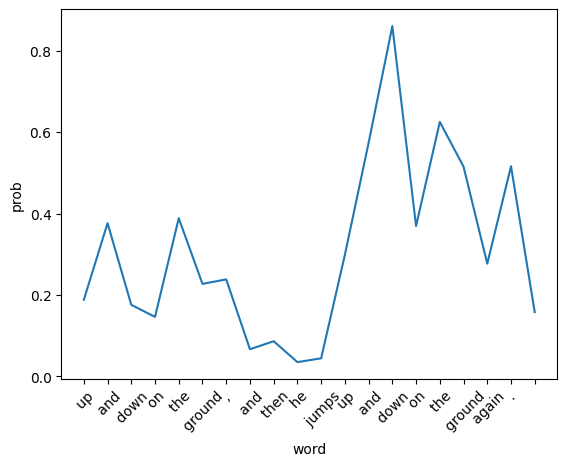

# Text Decoding from GPT-2 using Beam Search

## Beam Search
The objective is to explore decoding from a pre-trained GPT-2 model using beam search. Following is a visualization of the probabilities the model assigns for each generated word when using beam search with beam size 1 (i.e., greedy decoding) for input text `The brown fox jumps`

Observe that the model assigns a higher probability to tokens generated later than to tokens generated earlier. This is because, at the early stage, the model has seen only a few words. For instance, while generating the first word "up", the model knows only 4 words that come before it i.e. "The brown fox jumps".

Whereas, for the tokens generated later, the model has knowledge of more words as compared to the previous case. For example, when the word "down" is generated for the 2nd time, the model knows about a lot of words that were generated before i.e. "The  brown  fox  jumps up  and  down  on  the  ground,  and  then  he  jumps  up  and".

Due to this reason, higher probability is assigned to tokens generated later than to tokens generated earlier because, for tokens generated later, the model has more context about the sequence of tokens that come before it.

Following is a visualization of the word probabilities using different beam sizes for input text `Once upon a time, in a barn near a farm house,`

## Avoiding Repetition in Beam Search

Beam search often results in repetition in the predicted tokens. To avoid this a score processor called `WordBlock` is used. At each time step, it reduces the probability for any previously seen word so that it is not generated again. Following is the output of beam search with and without using `WordBlock` for input text `Once upon a time, in a barn near a farm house,`

| Method | Output |
| --- | --- |
| Beam Search | Once upon a time, in a barn near a farm house, a young boy was playing with a stick. He was playing with a stick, and the boy was playing with a stick. The boy was playing with a stick, and the boy was playing with a |
| Beam Search w/ Word Block | Once upon a time, in a barn near a farm house, the young girl was playing with her father's dog. She had been told that she would be given to him by his wife and he could take care of it for herself if needed; but when they |

Even though `WordBlock` avoids generation of seen words, it is not a practical way to prevent repetition in beam search due to the following reasons :-

1.   Even though repetition is undesirable sometimes, there are cases where repetition is needed but WordBlock will strictly avoid repetition even in these scenarios. For instance, in the code above that demonstrates WordBlock, the model incorrectly generated "the young girl" instead of "a young girl" because the article "a" is already present in the input. And later, the model does not generate correct pronouns (he instead of she) because the correct pronoun has been generated before and Wordblock penalizes the correct pronoun. This results in less fluent and grammatically incorrect outputs.

2.   Incorporating WordBlock into beam search introduces an additional computational cost. The decoder needs to check and apply the penalty for each generated token, which can increase the decoding time.

3. WordBlock is sensitive to the penalty value (1e-9 in the code above). Setting a very high penalty excessively discourages repetition and results in ungrammatical and incoherent output. On the other hand, setting a low penalty may have zero impact on preventing repetition.

## BeamBlock vs WordBlock

To overcome the disadvantages of `WordBlock`, a new score processor called `BeamBlock` is used. Instead of uni-grams, `BeamBlock` implementation prevents tri-grams from appearing more than once in the sequence. Following is the output of beam search with and without using `BeamBlock` for input text `Once upon a time, in a barn near a farm house,`

| Method | Output |
| --- | --- |
| Beam Search | Once upon a time, in a barn near a farm house, a young boy was playing with a stick. He was playing with a stick, and the boy was playing with a stick. The boy was playing with a stick, and the boy was playing with a |
| Beam Search w/ Beam Block | Once upon a time, in a barn near a farm house, a young boy was playing with a stick. He was playing on the stick, and the boy was trying to get a ball. The boy was holding the stick in his hand, and he was trying |
